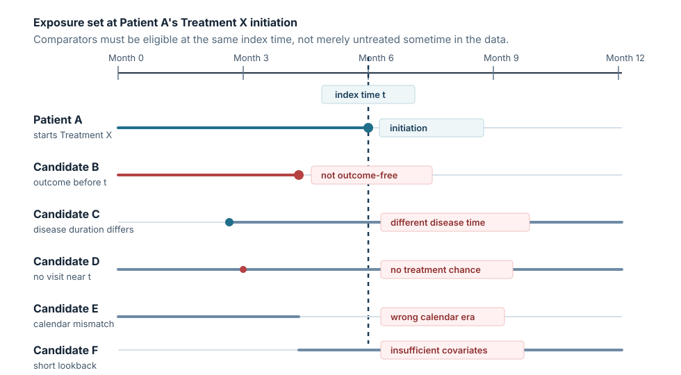

上一篇我們先處理一個直覺問題：如果 Treatment X 是在追蹤過程中才開始的，直接把患者分成 ever-treated 和 never-treated，常常會把 time zero 放錯。

這一篇往前走一步。假設 Patient A 在 Disease A 診斷後第 6 個月開始 Treatment X。現在我們要問：

> 在 Patient A 開始 Treatment X 的這一天，誰才有資格成為 not-yet-treated comparator？

注意，這裡說的是 not-yet-treated，不是 never-treated。一位 comparator 在第 6 個月尚未開始 Treatment X，未來仍然可能開始。重點不是他一生是否會用 Treatment X，而是在 Patient A 的 index time，他是否仍然符合可以被比較的條件。

這就是 exposure set 的核心：每當一位患者開始 Treatment X，我們就在同一個 index time 附近，找出當下仍然 eligible、尚未開始 Treatment X、且可以合理代表替代選擇的患者。

下面這張圖先把問題放在一條橫向時間軸上。

圖裡的 Patient B 到 Patient F 都「看起來」可能是 comparator，因為他們沒有在 Patient A 的 index time 之前使用 Treatment X。但如果仔細檢查，他們分別卡在不同的 eligibility 問題上。

## 1. Patient B：他還在風險集中嗎？

Patient B 看似可用，因為他沒有開始 Treatment X。若資料表只看 treatment status，他會被歸到 untreated 或 never-treated。

問題是，他在 Patient A 開始 Treatment X 之前已經發生 outcome。這代表在 Patient A 的 index time，Patient B 已經不在同一個 risk set 裡。把他拿來當 comparator，等於讓 treated patient 從第 6 個月開始承擔風險，卻讓 comparator 帶著已經發生的 outcome 進入比較。

設計上應該怎麼修正？在建立 exposure set 時，comparator 必須在 index time 仍然 outcome-free，而且仍然在可觀察的追蹤狀態中。這是最基本的 eligibility check。

## 2. Patient C：他的 disease duration 對得上嗎？

Patient C 也還沒有開始 Treatment X，也沒有在 index time 前發生 outcome。乍看之下，他比 Patient B 合理。

但如果 Patient C 剛被診斷 Disease A 一個月，而 Patient A 已經在疾病診斷後第 6 個月才開始 Treatment X，兩者就不一定在相同的疾病進程位置。相反地，如果 Patient C 已經被診斷三年，也可能代表完全不同的臨床階段、治療歷史和用藥決策背景。

設計上，exposure set 不只是把同一天仍未用藥的人放在一起，而是要考慮 disease duration 或其他代表疾病進程的時間尺度。實務上可以用診斷後時間、首次符合 cohort eligibility 後時間，或特定疾病里程碑後時間來限制 comparator。

## 3. Patient D：他真的有機會被開 Treatment X 嗎？

Patient D 的 disease duration 和 Patient A 接近，也沒有發生 outcome。表面上，他是很好的 comparator。

但假設 Patient D 在 index time 附近沒有任何門診、處方或可觀察的醫療接觸。那麼他沒有開始 Treatment X，可能不是因為臨床上做出了「不使用」的選擇，而是因為資料中根本沒有一次可以觀察到用藥決策的機會。

這會讓 untreated status 變得混雜：有些人是真的在同一時間點被觀察並選擇不開始，有些人只是沒有被看見。設計上，我們應該要求 comparator 在 index time 附近有合理的 visit opportunity 或 prescription opportunity。也就是說，他不只是尚未使用 Treatment X，而是有機會被評估是否開始 Treatment X。

## 4. Patient E：calendar time 對得上嗎？

Patient E 的疾病進程、風險狀態、就醫機會都看起來合理。問題出在 calendar time。

假設 Patient A 的 index time 是 Treatment X 上市後、指南更新後，或保險給付條件改變後；Patient E 的對應時間點卻是在這些變化之前。那麼 Patient E 沒有開始 Treatment X，可能不是個人臨床選擇，而是因為當時 Treatment X 還不可及、還不常用，或當時醫療系統的處方規則不同。

設計上，exposure set 應該在 calendar time 上有可比性。至少要避免把不同治療可近性、不同指南環境、不同資料品質時期的人直接放在同一個比較組裡。這可以透過 calendar-time matching、限制納入期間，或在後續模型中嚴格處理 calendar time。

## 5. Patient F：baseline covariates 真的量得到嗎？

Patient F 最容易被忽略。他在 index time 仍然 outcome-free，也尚未開始 Treatment X；disease duration、calendar time、就醫機會看起來都還可以。

但如果 Patient F 在資料庫裡只有很短的歷史觀察期，我們就可能無法量到同樣品質的 baseline covariates。例如 comorbidity、prior medication、healthcare utilization 或 disease severity proxy。這不是單純的 missing data 問題，而是 comparator 的可比性問題。

設計上，所有進入 exposure set 的人都應該有足夠且一致的 covariate measurement window。也就是說，在 index time 前，要有一段事先定義好的 lookback period，可以用來量測 baseline characteristics。否則 TCPS 或其他 propensity score 方法會在不公平的資訊基礎上工作。

## 把五個問題整理成 checklist

每當一位 Patient A 在時間點 t 開始 Treatment X，我們可以先不要急著估計 propensity score，而是問五個問題：

1. 這位候選 comparator 在 t 時仍然 outcome-free，且仍在追蹤中嗎？
2. 他的 disease duration 或疾病進程位置，和 initiator 在 t 時足夠接近嗎？
3. 他在 t 附近有可觀察的 visit opportunity 或 prescription opportunity 嗎？
4. 他的 calendar time 是否和 initiator 的治療決策環境可比？
5. 他在 t 之前是否有足夠的 covariate measurement window？

通過這些檢查之後，他才比較像「在 Patient A 開始 Treatment X 的那一刻，仍然可以作為替代選擇的人」。

這也是 exposure set 和一般 untreated group 的差別。Exposure set 不是靜態分組，而是在每一個 treatment initiation time 重新定義比較的起點。Comparator 的 time zero 不是自己的診斷日，也不是資料庫進入日，而是對應到 initiator 的 index time。

## 這一步不是技術細節，而是研究問題本身

很多 RWE 分析會把 comparator selection 當成資料處理步驟，好像只要最後 propensity score balance 看起來不錯，設計問題就解決了。

但如果 exposure set 一開始就放進了錯誤的人，後面的模型很難補救。模型可以幫助我們在已定義好的比較對象之間調整 measured confounding；它不能自動修正錯位的 time zero，也不能讓已經不在風險集的人重新變成合理 comparator。

所以在 prevalent new-user design 或 TCPS 之前，真正要先問的是：

> 在這個 index time，誰真的有資格被比較？

這個問題回答清楚了，後面的 matching、weighting 或 TCPS 才有意義。

## 下一篇

下一篇我會把這個 checklist 放進一個最小 longitudinal table 裡。也就是說，我們不再只用 Patient A/B/C 的文字故事，而是用一個小資料表逐列判斷：哪一列代表 treatment initiation，哪一些 not-yet-treated patients 可以進入同一個 exposure set，哪些人應該被排除。

等這個資料表例子清楚之後，再往 TCPS 或 R code 走，讀起來會更穩。

## References

- Suissa S, Moodie EEM, Dell'Aniello S. Prevalent new-user cohort designs for comparative drug effect studies by time-conditional propensity scores. *Pharmacoepidemiology and Drug Safety*. 2017;26(4):459-468. [PubMed](https://pubmed.ncbi.nlm.nih.gov/27610604/)
- Her QL, Gamble JM, Bartlett G, Filion KB. Core Concepts in Pharmacoepidemiology: New-User Designs. *Pharmacoepidemiology and Drug Safety*. 2024. [PubMed](https://pubmed.ncbi.nlm.nih.gov/39586646/)
