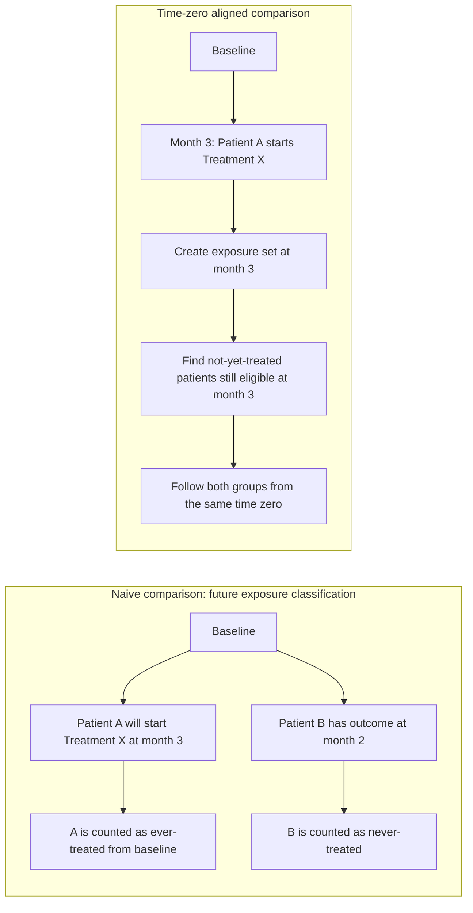

假設我們正在做一個 Disease A 的真實世界研究（real-world evidence, RWE）。研究問題看起來很直覺：

> 開始使用 Treatment X 的患者，和沒有開始 Treatment X 的患者相比，後續 outcome 的風險是否不同？

這句話聽起來很合理。甚至你可能已經在腦中打開資料表了：先找出所有 Disease A 患者，再把他們分成 ever-treated 和 never-treated，然後比較兩組的 outcome。簡單、乾淨、好像也很符合「治療組 vs 非治療組」的直覺。

但這個設計可能從第一步就出錯。

## 一個看似無害的錯誤示範

先看兩位虛構患者。

Patient A 在 Disease A 診斷後進入追蹤。前兩個月沒有使用 Treatment X，第 3 個月才開始 Treatment X。從那一天起，我們可以說 Patient A 是 Treatment X initiator。

Patient B 也在同一時間附近進入追蹤，但第 2 個月就發生 outcome，之後自然也不可能再開始 Treatment X。

如果我們在分析時把 Patient A 放進 ever-treated group，並且從 baseline 就開始計算他的 treated follow-up，那就悄悄做了一件危險的事：我們把 Patient A 在第 0 到第 3 個月之間、尚未接受 Treatment X 的時間，也算進了 treated group。

更麻煩的是，Patient A 必須先「活到」第 3 個月，才有資格成為 ever-treated patient。這段從 baseline 到治療開始前的時間，對 ever-treated group 來說不是一般的時間：如果 Patient A 在第 2 個月就發生 outcome，他就不會被歸類為 Treatment X 的使用者。

也就是說，ever-treated group 內部可能包含一段 outcome 不可能發生在「已開始治療者」身份下的時間。這就是不死時間偏倚（immortal time bias）的直覺版本。

## 問題不只是 bias，而是 time zero 放錯了

很多時候，我們會把問題說成 immortal time bias。但在 RWE study design 裡，更根本的問題是時間零點（time zero）沒有對齊。

Patient A 的真正治療開始點是第 3 個月。可是 naive comparison 卻好像從 baseline 就把他放進 Treatment X group。這等於把「Disease A 診斷日」和「Treatment X 開始日」混在一起。

對 never-treated group 也有類似問題。never-treated patients 的 follow-up 往往從 baseline 開始，但 treated patients 的臨床決策其實發生在之後某個時間點。這樣比較的兩組，不只 treatment status 不同，連被觀察、被選入、開始承擔風險的時間點都不同。

如果用 target trial emulation 的語言來說，eligibility、treatment assignment、time zero 和 follow-up start 不能各說各話。否則我們比較到的，可能不是 Treatment X 與 non-use 的差異，而是追蹤時間、疾病進程、就醫機會和治療決策時點混在一起的結果。

## 比較合理的問題應該怎麼問？

對 Patient A 來說，更合理的問題不是：

> Patient A 屬於 ever-treated，所以從 baseline 就和 never-treated patients 比較。

而是：

> 在 Patient A 第 3 個月開始 Treatment X 的那一天，有沒有其他 Disease A 患者也還在追蹤中、尚未開始 Treatment X、尚未發生 outcome，並且在相近時間點有就醫或處方機會？

這些患者才比較像 Patient A 在第 3 個月時的尚未治療對照者（not-yet-treated comparators）。

換句話說，我們不是把人一開始就永久貼上 ever-treated 或 never-treated 標籤，而是在每一個 treatment initiation time 建立一個 exposure set。每當一位患者開始 Treatment X，就在同一個疾病進程時間點附近尋找仍然 eligible 的 not-yet-treated patients，並從同一個 time zero 開始 follow-up。

下面是這個想法的簡化圖。

這個圖的重點不是技術細節，而是比較的起點。Treatment X initiator 的 follow-up 應該從 Treatment X initiation 開始；comparator 的 follow-up 也要從對應的 matched time zero 開始。

## 這和 prevalent new-user design / TCPS 有什麼關係？

Prevalent new-user design（PNU design）和 time-conditional propensity score（TCPS）處理的，正是這類「治療在追蹤過程中才開始」的設計問題。

在原始方法論文章中，Suissa、Moodie 和 Dell'Aniello 提出 PNU cohort designs，用來處理 head-to-head comparative drug effect studies 中，新使用者不足、且很多患者可能從既有治療轉換到新治療的情境。TCPS 的角色，是在每個 time-defined 或 prescription-defined exposure set 內，估計在該時間點開始某治療的相對傾向，並找出可比較的 comparator。

這篇文章先不進入公式，也不寫 R code。第一步只要抓住一個直覺：

> 如果治療是在追蹤中發生的，time zero 不能偷懶。比較對象必須在同一個時間點、相似的疾病進程與就醫機會下被放到一起。

這也是為什麼 ever-treated vs never-treated 雖然看起來簡單，卻常常不是一個好設計。簡單不是問題；把時間順序弄錯，才是問題。

## 下一篇

下一篇我想繼續拆 exposure set：當一位 Disease A 患者在第 t 個月開始 Treatment X 時，哪些 not-yet-treated patients 才能成為合理 comparator？這一步看似只是「找對照」，實際上會牽涉 disease duration、calendar time、visit opportunity、outcome-free eligibility，以及 covariate measurement window。

如果你也在 RWE study design 裡遇過 time zero 或 comparator selection 的困惑，歡迎留言或寄信給我。這個系列會從直覺開始，慢慢走到可實作的 design checklist 和最小 R 範例。

## References

- Suissa S, Moodie EEM, Dell'Aniello S. Prevalent new-user cohort designs for comparative drug effect studies by time-conditional propensity scores. *Pharmacoepidemiology and Drug Safety*. 2017;26(4):459-468. [PubMed](https://pubmed.ncbi.nlm.nih.gov/27610604/)
- Her QL, Gamble JM, Bartlett G, Filion KB. Core Concepts in Pharmacoepidemiology: New-User Designs. *Pharmacoepidemiology and Drug Safety*. 2024. [PubMed](https://pubmed.ncbi.nlm.nih.gov/39586646/)
